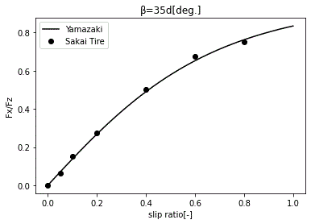

# Yamazaki Model Visualizer
### Interactive Tire Contact Force Simulator — Brush & Hertz Model

**Author:** Dr. Hiroo Yamazaki — *May 9th 2026*

---

Yamazaki Model Visualizer is an open-source Executable Engineering Model (EEM) for tire-road and wheel-rail contact mechanics.

Yamazaki Model Visualizer は、タイヤ・路面および車輪・レール間接触力学を対象としたオープンソース実行可能工学モデル（EEM）です。

ブラウザ上でタイヤ接触力モデルをリアルタイム可視化するスタンドアロンツールです。インストール・サーバー不要。

A self-contained, zero-dependency browser tool for real-time visualization of tire contact mechanics.

---

## 概要 / Overview

本ツールは **山崎モデル** を実装したインタラクティブビジュアライザです。

Brush Model（ブラシモデル）、Hertz（ヘルツ）楕円接触圧力、および速度依存動摩擦を統合し、接触楕円内の粘着/すべり域分布・接線力分布・トラクション特性曲線をリアルタイムに計算・描画します。

This tool implements the Yamazaki tire friction model, integrating the Brush Model, Hertz elliptical contact pressure, and velocity-dependent dynamic friction. It renders adhesion/slip zone maps, tangential force distributions, and traction characteristic curves in real time.

本モデル（Yamazaki Model）は、実測データ（Sakai Tire）に対して高い精度でフィッティングすることが確認されています。


*図：Sakai Tireの実測値（●）に対する Yamazaki モデル（実線）のフィッティング特性*
Fz = 3923[N], a, b = 0.1, 0.12 [m]
mus = 1.15, alfa= 0.1, beta= 0.005
Kx, Ky = 7.0 [MPa]



Fz = 3923[N], V = 20 [km/h], a, b = 0.1, 0.1215 [m]
vy = 0.305 [m/s], mus = 1.15, alfa= 0.1, beta = 0.001
Kx = 0.33, Ky = 0.66 [MPa]

---

## 使い方 / Usage

### ステップ 0 — ブラウザで直接開く（インストール不要）

👉 **https://hiroo718.github.io/yamazaki-model/Yamazaki_Model_Visualizer_Tire.html**

---

### ステップ 1 — リポジトリをクローン

Repository:

https://github.com/hiroo718/yamazaki-model

```bash
git clone https://github.com/hiroo718/yamazaki-model.git
cd yamazaki-model
```

---

### ステップ 2 — HTMLファイルをブラウザで開く

**macOS**

```bash
open Yamazaki_Model_Visualizer_Tire.html
```

**Windows**

```cmd
start Yamazaki_Model_Visualizer_Tire.html
```

**Linux**

```bash
xdg-open Yamazaki_Model_Visualizer_Tire.html
```

> [!NOTE]
> サーバーや依存ライブラリのインストールは一切不要です。
> Chrome / Firefox / Safari / Edge の最新版で即座に動作します。
>
> No server or library installation required. Works in any modern browser.

---

## 操作パネル / Control Panel

左側のコントロールスライダーで以下のパラメータをリアルタイムに変更可能です。

| スライダー | 説明 | 範囲 |
| --- | --- | --- |
| **$s_x$**（縦スリップ率） | 加減速方向のスリップ。$0$ = 純転がり、$1$ = 完全ロック | $0 \sim 1.0$ |
| **$s_y$**（横スリップ率） | 横力方向のスリップ（コーナリング相当） | $0 \sim 1.0$ |
| **$\mu_s$**（静摩擦係数） | 粘着限界を決める最大摩擦係数 | $0.10 \sim 0.60$ |
| **$\alpha$** | 速度無限大での動摩擦比 $\mu_\infty/\mu_0$ | $0 \sim 1.0$ |
| **$\beta$** | 動摩擦の速度依存減衰率（Stribeck効果） | $0.01 \sim 0.30$ |

---

## 表示パネル / Visualization Panels

```text
┌──────────────────┬────────────────┬────────────────┐
│  粘着/すべり域   │ 接線力|f|分布  │ 圧力分布p(x,y) │
│ Adhesion/Slip    │ Tangential |f| │ Hertz p(x,y)   │
├──────────────────┴────────────────┴────────────────┤
│      トラクション特性曲線 Fx/Fz, Fy/Fz            │
│      (sx sweep / sy sweep タブ切替)               │
└────────────────────────────────────────────────────┘
```

- **粘着/すべり域 (Adhesion/Slip Zone)**  
  青 = 粘着域（弾性変形支配）、赤 = すべり域（摩擦力飽和）

- **接線力 $|f|$ 分布 (Tangential Force Distribution)**  
  $\sqrt{f_x^2 + f_y^2}$ の空間分布をヒートマップ表示

- **圧力分布 $p(x,y)$ (Normal Pressure Distribution)**  
  Hertz 楕円接触に基づく法線力分布

- **トラクション特性 (Traction Characteristics)**  
  $s_x$ または $s_y$ を $0 \to 1$ までスイープした際の
  $F_x/F_z$, $F_y/F_z$ 曲線を表示

---

## モデルの理論 / Model Theory

### 1. Hertz 楕円接触圧力

タイヤと路面の接触形状を楕円形と仮定します。

$$\frac{x^2}{a^2}+\frac{y^2}{b^2}\le1$$

接触楕円内における法線圧力分布

$$p(x,y)=\frac{3F_z}{2\pi ab}\sqrt{1-\frac{x^2}{a^2}-\frac{y^2}{b^2}}$$

### 2. Brush Model — 弾性せん断応力

$$f_{x,e}(x,y)=G\,s_x\left(x+x_e(y)\right)$$

$$f_{y,e}(x,y)=G\,s_y\left(y+y_e(x)\right)$$

### 3. 粘着・すべり判定

$$\sqrt{f_{x,e}^2+f_{y,e}^2}>\mu_s\,p(x,y)$$

$$\mathbf{f}_{slip}=\mu_d(w)\,p(x,y)\frac{\mathbf{f}_e}{|\mathbf{f}_e|}$$

### 4. 速度依存動摩擦係数

$$\mu_d(w)=\mu_s\left[(1-\alpha)e^{-\beta w}+\alpha\right]$$

$$w=\sqrt{s_x^2+s_y^2}\,v_0$$

### 5. 合力の計算

$$\frac{F_x}{F_z}=\frac{1}{F_z}\iint_\Omega f_x(x,y)\,dx\,dy$$

$$\frac{F_y}{F_z}=\frac{1}{F_z}\iint_\Omega f_y(x,y)\,dx\,dy$$

---

## 固定パラメータ / Fixed Parameters

| 記号 | 値 | 説明 |
| --- | --- | --- |
| $a$ | 50 mm | 接触楕円半長軸 |
| $b$ | 74 mm | 接触楕円半短軸 |
| $F_z$ | 約4448 N | 垂直荷重 |
| $G$ | 10 MPa | ゴムせん断弾性率 |
| $v_0$ | 80 km/h | 基準車速 |
| $N,M$ | 60×60 | 計算メッシュ数 |

---

## ファイル構成 / Repository Structure

```text
yamazaki-model/
├── README.md
├── figure1.gif
├── Yamazaki_Model_Visualizer_Tire.html
└── CITATION.cff
```

---

## AI Assistance

The visualization was developed with the assistance of AI systems.

The theoretical formulation of the lateral force model was also discussed with AI assistance.

---

## 引用 / Citation

本ツールを研究、論文、または学会発表等に使用する場合は、`CITATION.cff` を参照して引用してください。

*If you use this tool in your research, please cite it using the metadata in `CITATION.cff`.*

---

## Contact

For questions or feedback, feel free to open a discussion on GitHub or contact:

- Email: yamazaki.hiroo@gmail.com
- GitHub Discussions: https://github.com/hiroo718/yamazaki-model/discussions

---

## 参考文献 / References

1. Yamazaki, H., Nagai, M. and Kamada, T., *A Study of Adhesion Force Model for Wheel Slip Prevention Control*, JSME International Journal, Series C, Vol.47, No.2, 2004, pp.496–501.

2. Yamazaki, H., *Adhesion Model Based on Hertz Contact Theory Using Coefficient of Dynamic Friction*, Transactions of the Japan Society of Mechanical Engineers, Series C, Vol.76, No.770, 2010, pp.82–87.

3. Abe, M., *Vehicle Handling Dynamics*, Butterworth-Heinemann, 2015.

4. Polach, O., *Creep Forces in Simulations of Traction Vehicles Running on Adhesion Limit*, Wear, Vol.258, 2005, pp.992–1000.

5. Shabana, A.A., Zaazaa, K.E., Sugiyama, H., *Railroad Vehicle Dynamics*, CRC Press, 2008.

6. Ohyama, T., RTRI Report, Vol.1, No.2, 1987.

7. Kalker, J.J., *Survey of Wheel-Rail Rolling Contact Theory*, Vehicle System Dynamics, 1979.
