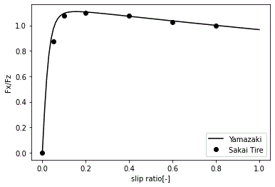

# Yamazaki Model Visualizer
### Interactive Tire Contact Force Simulator — Brush & Hertz Model

**Author:** Dr. Hiroo Yamazaki — *May 9th 2026*

---

Yamazaki Model Visualizer is an open-source Executable Engineering Model (EEM) for tire-road and wheel-rail contact mechanics.
Yamazaki Model Visualizer は、タイヤ・路面および車輪・レール間接触力学を対象としたオープンソース実行可能工学モデル（EEM）です。

ブラウザ上でタイヤ接触力モデルをリアルタイム可視化するスタンドアロンツールです。インストール・サーバー不要。
A self-contained, zero-dependency browser tool for real-time visualization of tire contact mechanics.

## 概要 / Overview

本ツールは **山崎モデル** を実装したインタラクティブビジュアライザです。Brush Model（ブラシモデル）、Hertz（ヘルツ）楕円接触圧力、
および速度依存動摩擦を統合し、接触楕円内の粘着/すべり域分布・接線力分布・トラクション特性曲線をリアルタイムに計算・描画します。

This tool implements the Yamazaki tire friction model, integrating the Brush Model, Hertz elliptical contact pressure,
 and velocity-dependent dynamic friction. It renders adhesion/slip zone maps, tangential force distributions,
 and traction characteristic curves in real time.

本モデル（Yamazaki Model）は、実測データ（Sakai Tire）に対して高い精度でフィッティングすることが確認されています。



*図：Sakai Tireの実測値（●）に対するYamazakiモデル（実線）のフィッティング特性*
---

## 使い方 / Usage
### ステップ 0 — ブラウザで直接開く（インストール不要）

👉 **https://hiroo718.github.io/yamazaki-model/Yamazaki_Model_Visualizer_Tire.html**

### ステップ 1 — リポジトリをクローン
```bash
git clone [https://github.com/hiroo718/yamazaki-model.git](https://github.com/hiroo718/yamazaki-model.git)
cd yamazaki-model 　　これがそもそもおかしくない？
